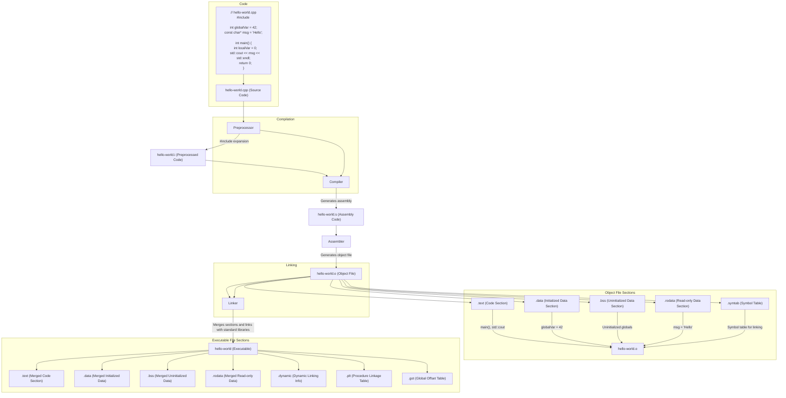

# Building a program

Here start our journey of a deep understanding or all the parts involved in the
process of building a program file into an binary executable that is suitable to
run in a given target. Beforehand let's define some terms that will be
constantly used throughout this text.

- `Building`: is the whole process to transform a program file into an
executable suitable to run in a given target. It comprise but is not limited to
the `preprocessing`, `compilation`, `assembly` and `linking`.

- `Compilation`: the process of translating source code written in a high-level
programming language into assembly code. This is typically done by a compiler,
which checks the code for syntax errors and converts it into a lower-level
representation that can be further processed by the assembler.

- `Host`: The system on which the development and building of the program takes
place. This is where the source code is written, compiled, and linked.

- `Target`: The system on which the final executable program will run. This can
be different from the host system, especially in cross-compilation scenarios.

- `Program`: A set of instructions written in a high-level programming language
that performs a specific task when executed.

- `Executable`: The binary file generated after the compilation and linking
process, which can be run on the target system to perform the tasks defined in
the program.

- `Process`: An instance of a program that is being executed by the operating
system. It includes the program code and its current activity.

## Steps involved in the building process

In order to a program file to become an executable suitable to run in a target
we need to build it first. Building a simple program using a compiler like
`GNU GCC` could be done in a single command as below:

```shell
g++ -o main main.cpp
```

Although it might seem from the command above the building process happens in
one go, in a single step, that is not true. What is happening is that `g++` is
actually invoking four phase/steps behind the scenes: `preprocessing`,
`compilation`, `assembly` and the`liking`. For each of one of these steps in
the case of GNU-GCC, different tools are used:

- `cpp`: it's the GNU-GCC preprocessor used for C/C++ in the `preprocessing`
phase.
- `gcc\g++`: it's is the compiler itself used in the `compilation` phase.
- `as`: it's the GNU assembler, used during `assembly` phase to convert assembly
code into machine code (object files).
- `ld`: the GNU linker, used during the `linking` phase to combine object files
into a single executable, resolving references between them.

Later on in this text, we will go deeply in each one of these four phases to get
a better understanding of their purpose and what are their inputs and outputs.
But for the anxious reader (I'm one), lets build a simple C++ program to show
each phase individually using two approaches:

- 1: invoking each tool individually, in 4 stages.
- 2: using only `g++` but passing command line options to go one stage at a time
.


## Preprocessor

The **preprocessor phase** is the first phase of the compilation process of
C\C++ code. In this phase, the preprocessor processes directives that starts
with `#` in the source code, predefined macros, removes comments and spaces
and line splicing are concatenated in one line.


Let's analyze what is the output of the `g++` preprocessor for the program
below.

```

```

## Compiler


## Assembler


## Linker


## Locator

### Linker script file


## Examples

### Build a single file program

### Build a multi-file program

Show step by step all the stages and
linking at the end


## References

https://blog.cloudflare.com/how-to-execute-an-object-file-part-1/

https://www.linkedin.com/pulse/c-build-process-details-abdelaziz-moustafa/

https://www.linkedin.com/pulse/understanding-c-build-process-from-source-code-haresh-sondagar-gptof/

https://unstop.com/blog/compilation-in-c

https://faculty.cs.niu.edu/~mcmahon/CS241/Notes/build.html

https://faculty.cs.niu.edu/~mcmahon/CS241/Notes/build.html

https://en.cppreference.com/w/cpp/language/translation_phases#Phase_4


``` mermaid
    B --> |"Removes comments, expands macros"| C["Preprocessed Source Code (.i/.ii)"]
    C --> D["Compiler"]
    D --> |"Generates assembly code"| E["Assembly Code (.s)"]
    E --> F["Assembler"]
    F --> |"Generates machine code"| G["Object File (.o)"]
    G --> H["Linker"]
    H --> |"Links object files and libraries"| I["Executable (.out/.exe)"]

    subgraph Compilation
        B --> D
    end

    subgraph Linking
        G --> H
    end

    H --> J{"External Libraries"}
    J --> |"Links with external code"| I
```

