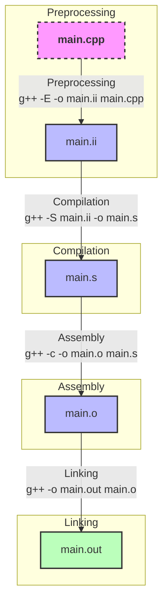

# Basics of building a program - Part1

- [Basics of building a program - Part1](#basics-of-building-a-program---part1)
  - [Steps involved in the building process](#steps-involved-in-the-building-process)
    - [Building using `g++` in 4 steps](#building-using-g-in-4-steps)
    - [Building using `cpp`, `g++`, `as` and `ld`](#building-using-cpp-g-as-and-ld)
    - [Conclusion](#conclusion)
  - [References](#references)

Here starts our journey of a deep understanding of all the parts involved in
the process of building a program file into a binary executable that is
suitable to run on a given target. Beforehand let's define some terms that will
be constantly used throughout this text.

- `Building`: is the whole process to transform a program file into an
  executable suitable to run on a given target. It comprises but is not limited
  to the `preprocessing`, `compilation`, `assembly`, and `linking`.

- `Compilation`: the process of translating source code written in a high-level
  programming language into assembly code. This is typically done by a
  compiler, which checks the code for syntax errors and converts it into a
  lower-level representation that can be further processed by the assembler.

- `Host`: The system on which the development and building of the program take
  place. This is where the source code is written, compiled, and linked.

- `Target`: The system on which the final executable program will run. This can
  be different from the host system, especially in cross-compilation scenarios.

- `Program`: A set of instructions written in a high-level programming language
  that performs a specific task when executed.

- `Executable`: The binary file generated after the compilation and linking
  process, which can be run on the target system to perform the tasks defined
  in the program.

- `Process`: An instance of a program that is being executed by the operating
  system. It includes the program code and its current activity.

## Steps involved in the building process



In order for a program file to become an executable suitable to run on a target,
we need to build it first. Building a simple program using a compiler like
`GNU GCC` could be done in a single command as below:

```shell
g++ -o main main.cpp
```

Although it might seem from the command above that the building process happens
in one go, in a single step, that is not true. What is happening is that `g++`
is actually invoking four stages/steps behind the scenes: `preprocessing`,
`compilation`, `assembly`, and `linking`. For each of these steps in the case
of GNU-GCC, different tools are used:

- `cpp`: it's the GNU-GCC preprocessor used for C/C++ in the `preprocessing`
  stage.
- `gcc\g++`: it's the compiler itself used in the `compilation` stage.
- `as`: it's the GNU assembler, used during the `assembly` stage to convert
  assembly code into machine code (object files).
- `ld`: the GNU linker, used during the `linking` stage to combine object files
  into a single executable, resolving references between them.

In other articles, we will go deeply into each one of these four stages to
get a better understanding of their purpose and what are their inputs and
outputs. But for the anxious reader (I'm one), let's build a simple C++ program
to show each stage individually using two approaches:

1. Using only `g++` but passing command line options to go one stage at a time.
2. Invoking each tool individually, in 4 stages.

Let's use the simple program below for our example:

```c++
#include <iostream>

double add(double a, double b){
    return a + b;
}

int main() {
    std::cout << add(1,1) << std::endl;
    
    return 0;
}
```

### Building using `g++` in 4 steps

It is possible to instruct `g++` to perform each stage of the building process
separately instead of all at once, this is done by specifying the following
options:

- `-E`: Stop after the preprocessing stage; do not run the compiler proper. The
  output is in the form of preprocessed source code, which is sent to the
  standard output. We can use the option `-o <file>` to save the preprocessed
  source code to `<file>`.

- `-S`: Stop after the stage of compilation proper; do not assemble. The output
  is in the form of an assembler code file for each non-assembler input file
  specified. By default, the assembler file name for a source file is made by
  replacing the suffix `.c`, `.i`, etc., with `.s`.

- `-c`: Compile or assemble the source files, but do not link. The linking
  stage simply is not done. The ultimate output is in the form of an object
  file for each source file. By default, the object file name for a source file
  is made by replacing the suffix `.c`, `.i`, `.s`, etc., with `.o`.

- There is no specific option to just link the object file. Linking can be done
  by using the command `g++ -o <output-file> [object-file ...]`.

Let's now build the program above stage-by-stage using g++:

```shell
# 1st stage: preprocessing
$ g++ -E -o main.ii main.cpp
# This will apply the preprocessor `cpp` to the main.cpp file and save the 
# output to main.ii 
```

Now we can pass the preprocessed file `main.ii` as input to the next stage, the
`compilation`. (I used `.ii` just as a convention that it is a C++ preprocessed
file).

```shell
# 2nd stage: compilation / compilation proper
$ g++ -S main.ii
# As no output file was specified it will save the output of this stage to a
# file main.s
```

Now we can pass the `main.s` file to the next stage, the `assembly`.

```shell
# 3rd stage: assembly
g++ -c main.s
# As no output file was specified it will save the output of this stage to a
# file main.o
```

Finally, we need to link the `main.o` file in order to produce an executable
that can run on a target.

```shell
# 4th stage: Linking
$ g++ -o main.out main.o
# A main.out file is created, this is an executable
```

Now we can simply run the `main.out` file, 2 shall be printed on the terminal.

```shell
# Run the executable, main.out
$ ./main.out
$ 2
```

So now we have accomplished the same result of `g++ -o main.out main.cpp` but
commanding `g++` to execute each stage explicitly.

Putting all together:

```shell
$ g++ -E -o main.ii main.cpp # generates main.ii
$ g++ -S main.ii # generates the main.s file
$ g++ -c main.s # generates the main.o
$ g++ -o main.out main.o # generates main.out
$ ./main.out # runs the executable
$ 2 # output
```

### Building using `cpp`, `g++`, `as` and `ld`

Now instead of using `g++` let's use the under-the-hood tools that `g++` uses
in each stage to accomplish the same result.

```shell
# 1st stage: preprocessing
$ cpp -o main.ii main.cpp
# Use `cpp` directly to the main.cpp file and save the output to main.ii 
```

As before we pass the `main.ii` as input to the `compilation` stage:

```shell
# 2nd stage: compilation / compilation proper
$ g++ -S main.ii
# As no output file was specified it will save the output of this stage to the
# file main.s
```

Now `main.s` is passed to the `assembly` stage to generate the object file:

```shell
# 3rd stage: assembly
as -o main.o main.s
# As no output file was specified it will save the output of this stage to a
# file main.o
```

The last step is the `linking` stage, but this time as you can see below we
need to pass a lot more inputs to the `ld` command than we passed to the `g++`
in this same stage:

```shell
# 4th stage: Linking
$ ld -o main.out \
/usr/lib/gcc/x86_64-linux-gnu/13/../../../x86_64-linux-gnu/Scrt1.o \
/usr/lib/gcc/x86_64-linux-gnu/13/../../../x86_64-linux-gnu/crti.o \
main.o \
-L/usr/lib/gcc/x86_64-linux-gnu/13 \
-L/usr/lib/gcc/x86_64-linux-gnu/13/../../../x86_64-linux-gnu \
-L/usr/lib/gcc/x86_64-linux-gnu/13/../../../../lib \
-L/lib/x86_64-linux-gnu \
-L/usr/lib/x86_64-linux-gnu \
-lstdc++ \
-lm \
-lgcc_s \
-lgcc \
-lc \
/usr/lib/gcc/x86_64-linux-gnu/13/crtendS.o \
/usr/lib/gcc/x86_64-linux-gnu/13/../../../x86_64-linux-gnu/crtn.o \
-dynamic-linker /lib64/ld-linux-x86-64.so.2
# A main.out file is created, this is an executable
```

When using `ld` directly, we need to manually specify all the necessary startup,
initialization, and termination files, as well as the directories to search for
libraries and the libraries themselves. This is because `ld` does not
automatically include these files and directories like `g++` does. By
specifying these arguments, we ensure that the linker has all the information
it needs to create a complete and functional executable. Further, we will go
into details of how to use `ld`, for now let's just explain some of the options
passed in the command above.

- `-o main.out`: Specifies the output file name for the executable.
- `Scrt1.o`: The startup file that contains the entry point `_start`. It sets up
  the runtime environment before calling the `main` function.
- `crti.o`: The initialization file that contains code to run before `main`.
- `main.o`: The object file generated from the assembly stage.
- `-L <library-paths>`: paths to search for libraries.
- `-lstdc++`: Links the C++ standard library.
- `-lm`: Links the math library.
- `-lgcc_s`: Links the GCC support library.
- `-lgcc`: Links the GCC library.
- `-lc`: Links the C standard library.
- `crtendS.o`: The termination file that contains code to run after `main`.
- `crtn.o`: Another termination file.
- `-dynamic-linker /lib64/ld-linux-x86-64.so.2`: Specifies the dynamic linker to
  be used for the executable.

As before we can run the `main.out` the same way:

```shell
# Run the executable, main.out
$ ./main.out
$ 2
```

### Conclusion

In this tutorial, we have explored the four stages involved in building a
program: `preprocessing`, `compilation`, `assembly`, and `linking`. We
demonstrated how to use `g++` to perform each stage separately and how to use
the underlying tools (`cpp`, `g++`, `as`, and `ld`) to achieve the same result.
Understanding these stages and the tools involved provides a deeper insight into
the building process and allows for more control and customization when
compiling and linking programs.

## References

- [Gentoo CRT](https://dev.gentoo.org/~vapier/crt.txt)
- [Wikipedia: Crt0](https://en.wikipedia.org/wiki/Crt0)
- [Linux Program Startup](http://dbp-consulting.com/tutorials/debugging/linuxProgramStartup.html)
- [GNU Compiler Collection (GCC) Internals](https://gcc.gnu.org/onlinedocs/gccint/)
- [GNU Binutils Documentation](https://sourceware.org/binutils/docs-2.36/)
- [Linkers and Loaders by John R. Levine](https://www.iecc.com/linker/)