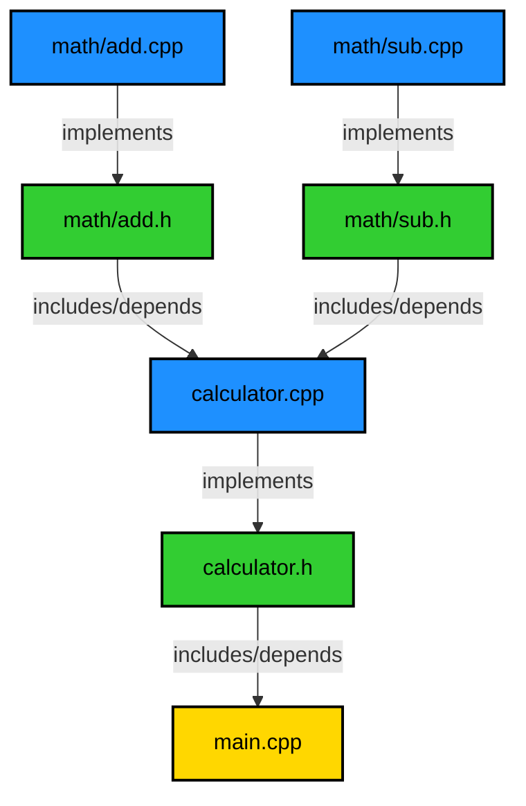

# Basics of building a program - Part 2

- [Basics of building a program - Part 2](#basics-of-building-a-program---part-2)
  - [Project structure](#project-structure)
  - [Building the project](#building-the-project)
    - [Step 1: Pre-process](#step-1-pre-process)
    - [Step 2: Compile](#step-2-compile)
    - [Step 3: Assembly](#step-3-assembly)
    - [Step 4: Link](#step-4-link)
  - [Understanding when object file needs to be generated](#understanding-when-object-file-needs-to-be-generated)
    - [Example: Adding a  new version of add function](#example-adding-a--new-version-of-add-function)
  - [The importance of header files](#the-importance-of-header-files)
  - [Bonus: Automating the build process with `make`](#bonus-automating-the-build-process-with-make)
  - [Conclusion](#conclusion)

In [part-1](../p1/README.md) we saw how to compile a
simple program with a single file. The following topics were covered:

- The four stages of building a program: `preprocessing`, `compiling`,
    `assembling`, and `linking`.
- How to use the `g++` command to compile a program.
- How to `g++` stop at a specific stage of the build process.
- How to use the underlying tools used by `g++` to build a program, namely
    `cpp`, `g++`, `as`, and `ld`.

If you haven't read [part-1](../p1/README.md), I recommend you do so before 
continuing with this part.

In this article, we will see how to build a program with multiple files.
Although the process is similar to building a program with a single file, that
is, the four stages of building a program are the same, there are some
differences that we need to consider.

Topics covered in this article:

- When building a program with multiple files, we need to pre-process, compile,
    and assemble each file separately.
- How to link all the object files into a single executable.
- We'll see that symbols/references are only resolved during the linking stage,
    which means that we can have a program that compiles and assembles without
    errors but fails during the linking stage.
- Understand when a file needs to be recompiled or not.
- How header files are used to share declarations between files.
- How important it is to have a good API design to avoid recompiling files that
    don't need to be recompiled.
- How to automate the build process with a build system like `make`.

## Project structure

The project structure is as follows:

```shell
|_ src/
        |_ main.cpp       # main application
        |_ calculator.h   # header file for calculator.cpp
        |_ calculator.cpp # implementation of calculator functions
        |_ math/
                |_ add.h   # header file for add.cpp
                |_ add.cpp # implementation of add function
                |_ sub.h   # header file for sub.cpp
                |_ sub.cpp # implementation of sub function
```

Source files can be found [here](./src), and also below:

main.cpp:

```cpp
#include <iostream>
#include "calculator.h"

int main() {
    double a = 10.0;
    double b = 5.0;
    char op = '+';
    double result = calculator(a, b, op);
    std::cout << "Result (a + b): " << result << std::endl;

    char op2 = '-';
    double result2 = calculator(a, b, op2);
    std::cout << "Result (a - b) : " << result2 << std::endl;

    return 0;
}
```

calculator.h:

```cpp
#ifndef CALCULATOR_H
#define CALCULATOR_H

double calculator(double a, double b, char op);

#endif
```

calculator.cpp:

```cpp
#include "calculator.h"
#include "math/add.h"
#include "math/sub.h"

double calculator(double a, double b, char op) {
    switch (op) {
        case '+':
            return add(a, b);
        case '-':
            return sub(a, b);
        default:
           return 0.0;
  }
}
```

math/add.h:

```cpp
#ifndef ADD_H
#define ADD_H

double add(double a, double b);

#endif
```

math/add.cpp:

```cpp
#include "add.h"

double add(double a, double b) {
    return a + b;
}
```

math/sub.h:

```cpp
#ifndef SUB_H
#define SUB_H

double sub(double a, double b);

#endif
```

math/sub.cpp:

```cpp
#include "sub.h"

double sub(double a, double b) {
    return a - b;
}
```

As can be seen, the project has a main application that uses a calculator to 
perform arithmetic operations. The calculator uses the `add` and `sub` 
functions to perform the arithmetic operations. The `add` and `sub` functions 
are implemented in separate files.

## Building the project

Before we build the project step by step, let's see how we can build the 
project with a single command using `g++`.

```shell
$ g++ -o main.out main.cpp calculator.cpp math/add.cpp math/sub.cpp
$ ./main.out
Result (a + b): 15
Result (a - b) : 5
```
The above command compiles all the source files and links them into a single 
executable. The output of the program is as expected.

What is happening behind the scenes when we run the above command?

The `g++` command above `pre-processes`, `compiles`, and `assembles` each file 
separately. Then it links all the object files into a single executable. The 
linking stage is where all the object files are combined into a single 
executable. One question that arises is, do we need to re-build all the files 
every time we change a single file? The short answer is no, this is where 
`header files` come into play. We only need to re-build the files that have 
changed and maybe the files that depend on the changed file, the maybe part 
will be clear soon.

To build the project in steps, we need to:

1. Pre-process, compile, and assemble each file separately.
2. Link all object files into a single executable.

Let do it step by step for each file.

### Step 1: Pre-process

```shell
$ cpp -o main.ii main.cpp
$ cpp -o calculator.ii calculator.cpp
$ cpp -o math/add.ii math/add.cpp
$ cpp -o math/sub.ii math/sub.cpp
```

### Step 2: Compile

```shell
$ g++ -S main.ii
$ g++ -S calculator.ii
$ g++ -S math/add.ii
$ g++ -S math/sub.ii
```

### Step 3: Assembly

```shell
$ as -o main.o main.s
$ as -o calculator.o calculator.s
$ as -o math/add.o math/add.s
$ as -o math/sub.o math/sub.s
```

### Step 4: Link

We will use the `g++` command to link all the object files into a single
executable instead of using the `ld` command directly. This is because `g++`
knows how to link C++ standard libraries and other libraries that are required
by the program. If we use the `ld` command directly, we need to specify all the
libraries that are required by the program, see
[part-1](../p1/README.md) for more details.

```shell
$ g++ -o main.out main.o calculator.o math/add.o math/sub.o
```

Now we can run the program:

```shell
$ ./main.out
Result (a + b): 15
Result (a - b) : 5
```

The output of the program is as expected.

## Understanding when object file needs to be generated

I will try to explain when a file or files need to be recompiled using our
project as an example.

First, let's see the dependencies between the files:



From the above diagram, we can see that `main.cpp` depends on `calculator.h`, 
`calculator.h` depends on `math/add.h` and `math/sub.h`, and `calculator.cpp`, 
`math/add.cpp`, and `math/sub.cpp` implement `calculator.h`, `math/add.h`, and 
`math/sub.h`, respectively. By implementing, I mean that the functions/methods 
declared in the header files are defined in the source files.

Note that `main.cpp` does not depend on `math/add.h` and `math/sub.h` directly, 
but it depends on `calculator.h`, which depends on `math/add.h` and `math/sub.h`.

When we pre-process, compile and assemble a file, an object file is generated. 
This object file generally does not contain the implementation of the functions 
declared in the header file, but it contains the references to the functions 
that are defined in other files. The references are resolved during the linking 
stage.

For example, when we compile `main.cpp`, the object file `main.o` contains a 
reference to the `calculator` function that is defined in `calculator.cpp`. The 
reference to the `calculator` function is resolved during the linking stage 
when we link all the object files into a single executable.

So, when do we need to generate a new object file for a file?

1. When the file itself has changed.
2. When the header file that the file depends on has changed.

For example:

- If we change `main.cpp`, we need to recompile `main.cpp` to generate a new 
    object file `main.o`.
- If we change `calculator.h`, we need to recompile `main.cpp` and 
    `calculator.cpp` to generate new object files `main.o` and `calculator.o`, 
    respectively.
- If we change `math/add.h`, we need to recompile `calculator.cpp` and 
    `math/add.cpp` to generate new object files `calculator.o` and `math/add.o`, 
    respectively.
- If we change `math/sub.h`, we need to recompile `calculator.cpp` and 
    `math/sub.cpp` to generate new object files `calculator.o` and `math/sub.o`, 
    respectively.
- If we change `calculator.cpp`, we need to recompile `calculator.cpp` to 
    generate a new object file `calculator.o`.
- If we change `math/add.cpp`, we need to recompile `math/add.cpp` to generate 
    a new object file `math/add.o`.
- If we change `math/sub.cpp`, we need to recompile `math/sub.cpp` to generate 
    a new object file `math/sub.o`.

The above list is not exhaustive, as we have multiple files that change at 
once, but it gives an idea of when a file needs to be recompiled.

> Note: Independent of the case, if any new object file is generated, we need 
> to link all the object files into a single executable.

### Example: Adding a  new version of add function

Let's say we want to add a new version of the `add` function that takes three 
arguments instead of two, called `add3`.

math/add.h:

```cpp
#ifndef ADD_H
#define ADD_H

double add(double a, double b);
double add3(double a, double b, double c); // declaration of new add3 function

#endif
```

math/add.cpp:

```cpp
#include "add.h"

double add(double a, double b) {
    return a + b;
}

// implementation of new add3 function
double add3(double a, double b, double c) {
    return a + b + c;
}
```

With the change above, which files need to be recompiled?

`math/add.h` and `math/add.cpp` have changed, so we need to recompile 
`math/add.cpp` to generate a new object file `math/add.o`. I said above that 
if we change `math/add.h`, we also need to recompile `calculator.cpp` to 
generate a new object file `calculator.o`. But in this case, `calculator.cpp` 
does not depend on `add3`, so we don't need to recompile `calculator.cpp`, 
tricky right? This is why I said the maybe part will be clear soon.

In this case we don't even need to link all the object files into a single 
executable, as the `main.cpp` does not depend on `add3` because it is not used 
in the `calculator.cpp` file.

For now, let's just recompile `math/add.cpp`:

```shell
$ g++ -c -o math/add.o math/add.cpp
```

Now let's change the `calculator.cpp` file to use the `add3` function:

calculator.cpp:

```cpp
#include "calculator.h"
#include "math/add.h"
#include "math/sub.h"

double calculator(double a, double b, char op) {
    switch (op) {
        case '+':
            return add(a, b);
        case 'o': // new operation, add 10 to the result
            return add3(a, b, 10.0);
        case '-':
            return sub(a, b);
        default:
            return 0.0;
    }
}
```

Now we need to recompile `calculator.cpp` to generate a new object file 
`calculator.o`:

```shell
$ g++ -c -o calculator.o calculator.cpp
```

Because we changed `calculator.cpp`, and `main.cpp` depends on 
`calculator.cpp`, we need to link all the object files into a single 
executable; otherwise, the executable would not be updated with the new 
version of the `calculator` function.

```shell
g++ -o main.out main.o calculator.o math/add.o math/sub.o
```

For the sake of completeness, let's also update the `main.cpp` file to use the 
new operation:

main.cpp:

```cpp
#include <iostream>
#include "calculator.h"

int main() {
    double a = 10.0;
    double b = 5.0;
    char op = '+';
    double result = calculator(a, b, op);
    std::cout << "Result (a + b): " << result << std::endl;

    char op2 = '-';
    double result2 = calculator(a, b, op2);
    std::cout << "Result (a - b) : " << result2 << std::endl;

    char op3 = 'o';
    double result3 = calculator(a, b, op3);
    std::cout << "Result (a + b + 10): " << result3 << std::endl;

    return 0;
}
```

Now we need to recompile `main.cpp` to generate a new object file `main.o`, link
 all the object files into a single executable, and run the program:

```shell
$ g++ -c -o main.o main.cpp
$ g++ -o main.out main.o calculator.o math/add.o math/sub.o
$ ./main.out
Result (a + b): 15
Result (a - b) : 5
Result (a + b + 10): 25
```

## The importance of header files

Header files are used to share declarations between files. They are used to 
declare functions, classes, variables, and constants that are used in multiple 
files. They are also used to define macros, include other header files, and 
define inline functions.

Header files act as a contract between the files and make it possible to build 
a program with multiple files into smaller parts. Implicitly, they also make 
the build process faster, as they isolate the parts of the program that need 
to be recompiled when a file changes.

## Bonus: Automating the build process with `make`

Building a program with multiple files can be cumbersome if we have to do it 
manually every time we change a file. Imagine having a project with hundreds 
of files; it would be a nightmare to build the project manually every time we 
change a file. Even worse is remembering which files need to be recompiled and 
linked.

This is where build systems like `make` come into play. `make` is a build 
automation tool that allows us to define a set of rules to build a program. It 
uses a `Makefile` to define the rules. I will create a separate series of 
articles about `make` and how to use it to build a program. For now, just 
accept that it is a tool that automates the build process and knows which 
files need to be recompiled and linked.

Let's create a `Makefile` in the root of the project with the following content:

```makefile
# Compiler
CXX = g++

# Compiler flags
CXXFLAGS = -Wall -Wextra -std=c++11

# Directories
SRC_DIR = .
MATH_DIR = math

# Source files
SRCS = $(SRC_DIR)/main.cpp \
       $(SRC_DIR)/calculator.cpp \
       $(MATH_DIR)/add.cpp \
       $(MATH_DIR)/sub.cpp

# Object files
OBJS = $(SRCS:.cpp=.o)

# Executable
TARGET = main.out

# Default target
all: $(TARGET)

# Linking the executable
$(TARGET): $(OBJS)
    $(CXX) -o $@ $^

# Compiling source files to object files
%.o: %.cpp
    $(CXX) $(CXXFLAGS) -c $< -o $@

# Clean up
clean:
    rm -f $(OBJS) $(TARGET)

# Phony targets
.PHONY: all clean
```

Now we can build the project with a single command, `make`:

```shell
$ make
# output
g++ -Wall -Wextra -std=c++11 -c main.cpp -o main.o
g++ -Wall -Wextra -std=c++11 -c calculator.cpp -o calculator.o
g++ -Wall -Wextra -std=c++11 -c math/add.cpp -o math/add.o
g++ -Wall -Wextra -std=c++11 -c math/sub.cpp -o math/sub.o
g++ -o main.out main.o calculator.o math/add.o math/sub.o
```

As we can see, `make` knows which files need to be recompiled and linked, and it
 does it for us. We can also clean up the project with the `clean` target:

```shell
$ make clean
# output
rm -f main.o calculator.o math/add.o math/sub.o main.out
```

That's it for this article. I hope you have learned something new about 
building a program with multiple files. In the next article, we will see how 
to build a library and link it to a program.

## Conclusion

In this article, we saw how to build a program with multiple files. We saw 
that we need to pre-process, compile, and assemble each file separately, and 
link all the object files into a single executable. We also saw that 
symbols/references are only resolved during the linking stage, which means 
that we can have a program that compiles and assembles without errors but 
fails during the linking stage. We also saw when a file needs to be recompiled 
or not, and how header files are used to share declarations between files. We 
also saw how important it is to have a good API design to avoid recompiling 
files that don't need to be recompiled. Finally, we saw how to automate the 
build process with a build system like `make`.
